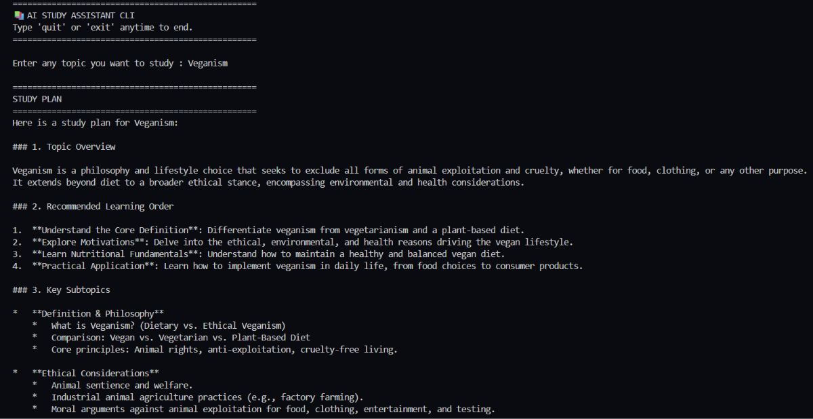
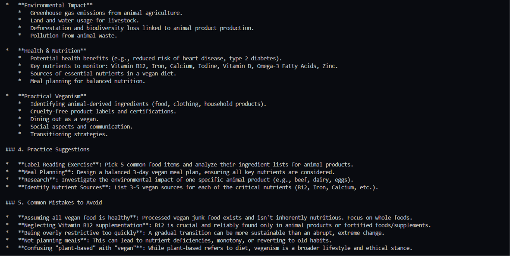
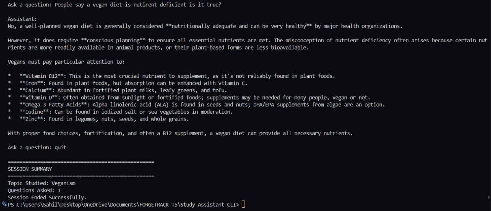

# AI Study Assistant CLI

A command-line AI-powered Study Assistant built using Python and Google's Gemini API. The assistant helps students create structured study plans, understand topics, and ask follow-up questions interactively.

---

## Features

* Generate study plans for any topic
* Interactive question-answer session
* Context-aware conversations
* Session summary at the end
* Powered by Google Gemini API
* Simple CLI interface

---

## Project Structure

```text
Study-Assistant-CLI/
│
├── main.py
├── .env
├── requirements.txt
├── README.md
└── venv/
```

---

## Installation

### 1. Clone the Repository

```bash
git clone https://github.com/Sahil964-star/Study-Assistant-CLI
cd Study-Assistant-CLI
```

### 2. Create Virtual Environment

```bash
python -m venv venv
```

### 3. Activate Virtual Environment

#### Windows

```bash
venv\Scripts\activate
```

#### Linux / macOS

```bash
source venv/bin/activate
```

### 4. Install Dependencies

```bash
pip install -r requirements.txt
```

---

## Environment Variables

Create a `.env` file in the project root:

```env
GEMINI_API_KEY=your_api_key_here
```

Replace `your_api_key_here` with your actual Gemini API key.

---

## Running the Application

```bash
python main.py
```

---

## Example Workflow

```text
==================================================
AI STUDY ASSISTANT CLI
==================================================

Enter a topic to study:
Machine Learning

==================================================
STUDY PLAN
==================================================

1. Topic Overview
2. Learning Roadmap
3. Key Concepts
4. Practice Exercises
5. Common Mistakes

Ask a question:
What is supervised learning?

Assistant:
Supervised learning is a machine learning approach...
```

---

## Technologies Used

* Python 3.13+
* Google Gemini API
* google-genai SDK
* python-dotenv

---

## Dependencies

```txt
google-genai
python-dotenv
```

---

## Session Features

The assistant maintains conversation context during the session and allows users to:

* Ask multiple follow-up questions
* Explore concepts in depth
* Generate topic-specific study plans
* Receive concise and structured responses

---

## Security Notes

* Never commit your `.env` file.
* Never expose your Gemini API key publicly.
* Add `.env` to `.gitignore`.

Example:

```gitignore
.env
venv/
__pycache__/
```

---


## Screenshots

### Outputs






---

## Future Improvements

* Save chat history
* Export study plans to PDF
* Multiple study modes
* Voice interaction
* Quiz generation
* Progress tracking

---

## Author

Developed as a learning project to explore:

* Python Development
* API Integration
* Prompt Engineering
* AI-Powered Applications
